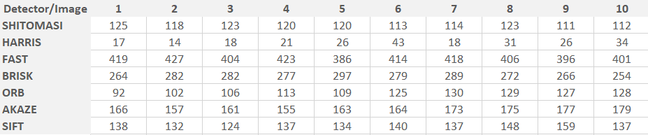
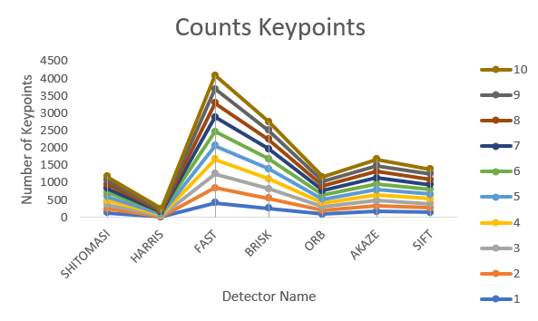
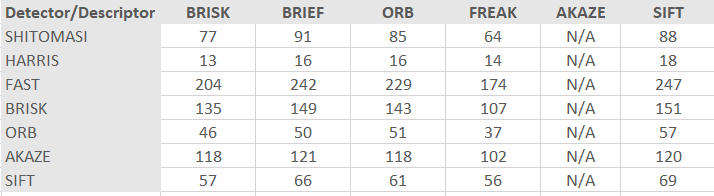
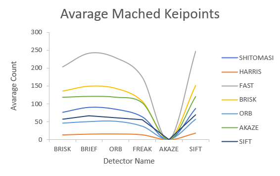
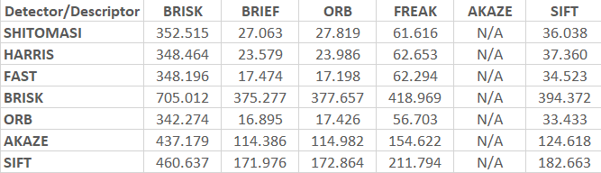
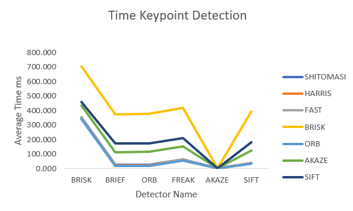
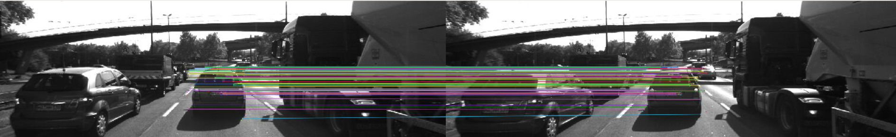

# SFND 2D Feature Tracking


The idea of the camera course is to build a collision detection system - that's the overall goal for the Final Project. As a preparation for this, you will now build the feature tracking part and test various detector / descriptor combinations to see which ones perform best. This mid-term project consists of four parts:

* First, you will focus on loading images, setting up data structures and putting everything into a ring buffer to optimize memory load. 
* Then, you will integrate several keypoint detectors such as HARRIS, FAST, BRISK and SIFT and compare them with regard to number of keypoints and speed. 
* In the next part, you will then focus on descriptor extraction and matching using brute force and also the FLANN approach we discussed in the previous lesson. 
* In the last part, once the code framework is complete, you will test the various algorithms in different combinations and compare them with regard to some performance measures. 

See the classroom instruction and code comments for more details on each of these parts. Once you are finished with this project, the keypoint matching part will be set up and you can proceed to the next lesson, where the focus is on integrating Lidar points and on object detection using deep-learning. 

## Dependencies for Running Locally
* cmake >= 2.8
  * All OSes: [click here for installation instructions](https://cmake.org/install/)
* make >= 4.1 (Linux, Mac), 3.81 (Windows)
  * Linux: make is installed by default on most Linux distros
  * Mac: [install Xcode command line tools to get make](https://developer.apple.com/xcode/features/)
  * Windows: [Click here for installation instructions](http://gnuwin32.sourceforge.net/packages/make.htm)
* OpenCV >= 4.1
  * This must be compiled from source using the `-D OPENCV_ENABLE_NONFREE=ON` cmake flag for testing the SIFT and SURF detectors.
  * The OpenCV 4.1.0 source code can be found [here](https://github.com/opencv/opencv/tree/4.1.0)
* gcc/g++ >= 5.4
  * Linux: gcc / g++ is installed by default on most Linux distros
  * Mac: same deal as make - [install Xcode command line tools](https://developer.apple.com/xcode/features/)
  * Windows: recommend using [MinGW](http://www.mingw.org/)

## Basic Build Instructions

1. Clone this repo.
2. Make a build directory in the top level directory: `mkdir build && cd build`
3. Compile: `cmake .. && make`
4. Run it: `./2D_feature_tracking`.


## Write up

## 1. The Data Buffer

#### Task MP.1 Data Buffer Optimization

The first task is to set up the loading procedure for the images, which is currently not optimal. 

file;  `MidTermProject_Camera_Student.cpp`   

* Lines 117 ~ 127 at 

```c++
// push image into data frame buffer
DataFrame frame;
frame.cameraImg = imgGray;

// ...add start: MP.1 Data Buffer Optimization
if (  dataBuffer.size()+1 > dataBufferSize) 
{
    dataBuffer.erase(dataBuffer.begin());
    cout << "REPLACE IMAGE IN BUFFER done" << endl;
}
// ...add end: MP.1 Data Buffer Optimization

```

### 2. Keypoints

#### Task MP.2 Keypoint Detection

second task is to focus on keypoint detection. implement a selection of alternative detectors, which are HARRIS, FAST, BRISK, ORB, AKAZE, and SIFT. 

File `MidTermProject_Camera_Student.cpp`

* Lines 148 ~ 167 at 


```c++
// ...add start: MP.2 Keypoint Detection
// detectorType = HARRIS
else if (detectorType.compare("HARRIS") == 0) 
{
    detKeypointsHarris(keypoints, imgGray, false);
}
// Modern detector types, detectorType = FAST, BRISK, ORB, AKAZE, SIFT
else if (detectorType.compare("FAST")  == 0 ||
        detectorType.compare("BRISK") == 0 ||
        detectorType.compare("ORB")   == 0 ||
        detectorType.compare("AKAZE") == 0 ||
        detectorType.compare("SIFT")  == 0)
{
    detKeypointsModern(keypoints, imgGray, detectorType, false);
}
else
{
    throw invalid_argument(detectorType + " is not a valid detectorType. Try SHITOMASI, HARRIS, FAST, BRISK, ORB, AKAZE, SIFT.");
}
// ...add end: MP.2 Keypoint Detection
```

File `matching2D_Student.cpp`

* Lines 171 ~ 294 at

```c++
// ...add start: MP.2 Keypoint Detection
// detectorType = HARRIS
void detKeypointsHarris(std::vector<cv::KeyPoint> &keypoints, cv::Mat &img, bool bVis)
{
    // Detector parameters
    int blockSize = 2;     // for every pixel, a blockSize × blockSize neighborhood is considered
    int apertureSize = 3;  // aperture parameter for Sobel operator (must be odd)
    int minResponse = 100; // minimum value for a corner in the 8bit scaled response matrix
    double k = 0.04;       // Harris parameter (see equation for details)

    double t = (double)cv::getTickCount();

    // Detect Harris corners and normalize output
    cv::Mat dst, dst_norm, dst_norm_scaled;
    dst = cv::Mat::zeros(img.size(), CV_32FC1);
    cv::cornerHarris(img, dst, blockSize, apertureSize, k, cv::BORDER_DEFAULT);
    cv::normalize(dst, dst_norm, 0, 255, cv::NORM_MINMAX, CV_32FC1, cv::Mat());
    cv::convertScaleAbs(dst_norm, dst_norm_scaled);

    // Look for prominent corners and instantiate keypoints

    double maxOverlap = 0.0; // max. permissible overlap between two features in %, used during non-maxima suppression
    for (size_t j = 0; j < dst_norm.rows; j++)
    {
        for (size_t i = 0; i < dst_norm.cols; i++)
        {
            int response = (int)dst_norm.at<float>(j, i);
            if (response > minResponse)
            { // only store points above a threshold

                cv::KeyPoint newKeyPoint;
                newKeyPoint.pt = cv::Point2f(i, j);
                newKeyPoint.size = 2 * apertureSize;
                newKeyPoint.response = response;

                // perform non-maximum suppression (NMS) in local neighbourhood around new key point
                bool bOverlap = false;
                for (auto it = keypoints.begin(); it != keypoints.end(); ++it)
                {
                    double kptOverlap = cv::KeyPoint::overlap(newKeyPoint, *it);
                    if (kptOverlap > maxOverlap)
                    {
                        bOverlap = true;
                        if (newKeyPoint.response > (*it).response)
                        {                      // if overlap is >t AND response is higher for new kpt
                            *it = newKeyPoint; // replace old key point with new one
                            break;             // quit loop over keypoints
                        }
                    }
                }
                if (!bOverlap)
                {                                     // only add new key point if no overlap has been found in previous NMS
                    keypoints.push_back(newKeyPoint); // store new keypoint in dynamic list
                }
            }
        } // eof loop over cols
    }     // eof loop over rows

    t = ((double)cv::getTickCount() - t) / cv::getTickFrequency();
    cout << "Harris corner detection with n=" << keypoints.size() << " keypoints in " << 1000 * t / 1.0 << " ms" << endl;

    // visualize results
    if (bVis)
    {
        cv::Mat visImage = img.clone();
        cv::drawKeypoints(img, keypoints, visImage, cv::Scalar::all(-1), cv::DrawMatchesFlags::DRAW_RICH_KEYPOINTS);
        string windowName = "Harris Corner Detector Results";
        cv::namedWindow(windowName, 6);
        imshow(windowName, visImage);
        cv::waitKey(0);
    }
}

// detectorType = FAST, BRISK, ORB, AKAZE, SIFT
void detKeypointsModern(std::vector<cv::KeyPoint> &keypoints, cv::Mat &img, std::string detectorType, bool bVis)
{
    double t = (double)cv::getTickCount();
    cv::Ptr<cv::Feature2D> detector;

    if(detectorType.compare("FAST") == 0)
    {
        detector = cv::FastFeatureDetector::create();
        detector->detect(img, keypoints);
    }
    else if(detectorType.compare("BRISK") == 0)
    {
        detector = cv::BRISK::create();
        detector->detect(img, keypoints);
    }
    else if(detectorType.compare("ORB") == 0)
    {
        detector = cv::ORB::create();
        detector->detect(img, keypoints);
    }
    else if(detectorType.compare("AKAZE") == 0)
    {
        detector = cv::AKAZE::create();
        detector->detect(img, keypoints);   
    }
    else if(detectorType.compare("SIFT") == 0)
    {
        detector = cv::xfeatures2d::SIFT::create();
        detector->detect(img, keypoints);        
    }
    else
    {
        throw invalid_argument(detectorType + " is not a valid detectorType. Try FAST, BRISK, ORB, AKAZE, SIFT.");
    }

    t = ((double)cv::getTickCount() - t) / cv::getTickFrequency();
    cout << detectorType << " detection with n=" << keypoints.size() << " keypoints in " << 1000 * t / 1.0 << " ms" << endl;

    // visualize results
    if (bVis)
    {
        cv::Mat visImage = img.clone();
        cv::drawKeypoints(img, keypoints, visImage, cv::Scalar::all(-1), cv::DrawMatchesFlags::DRAW_RICH_KEYPOINTS);
        string windowName = detectorType + " Keypoint Detector Results";
        cv::namedWindow(windowName, 6);
        imshow(windowName, visImage);
        cv::waitKey(0);
    }
}
// ...add end: MP.2 Keypoint Detection

```

#### Task MP.3 Keypoint Removal
The third task, therefore, is to remove all keypoints outside of a bounding box around the preceding vehicle. Box parameters you should use are : cx = 535, cy = 180, w = 180, h = 150. The coordinates are based on the Rectdatatype in OpenCV.

File `MidTermProject_Camera_Student.cpp`

* Lines 177 ~ 199

```c++

 //// TASK MP.3 -> only keep keypoints on the preceding vehicle

        // only keep keypoints on the preceding vehicle
        bool bFocusOnVehicle = true;
        cv::Rect vehicleRect(535, 180, 180, 150);
      
        // ...add start: MP.3 Keypoint Removal
        vector<cv::KeyPoint>::iterator keypoint;
        vector<cv::KeyPoint> keypoints_roi;
          // ...add end: MP.3 Keypoint Removal

          if (bFocusOnVehicle)
          {
            // ...add start: MP.3 Keypoint Removal
            for(keypoint = keypoints.begin(); keypoint != keypoints.end(); ++keypoint)
            {
              if (vehicleRect.contains(keypoint->pt))
              {  
                cv::KeyPoint newKeyPoint;
                newKeyPoint.pt = cv::Point2f(keypoint->pt);
                newKeyPoint.size = 1;
                keypoints_roi.push_back(newKeyPoint);
              }
            }

            keypoints =  keypoints_roi;
            cout << "IN ROI n= " << keypoints.size()<<" keypoints"<<endl;
            // ...add end: MP.3 Keypoint Removal
          }

```

### 3. Descriptors

#### Task MP.4 Keypoint Descriptors

The fourth task is to implement a variety of keypoint descriptors to the already implemented BRISK method and make them selectable using the string 'descriptorType'. The methods you must integrate are BRIEF, ORB, FREAK, AKAZE, and SIFT. 

File `MidTermProject_Camera_Student.cpp`

* Lines 258 ~ 268

```c++
//.. add start: MP.4 Keypoint Descriptors
string descriptorType;
if (descriptorType.compare("SIFT") == 0) 
{
    descriptorType == "DES_HOG";
}
else
{
    descriptorType == "DES_BINARY";
}                    
//.. add end: MP.4 Keypoint Descriptors 

```

File `matching2D_Student.cpp`

*In function `descKeypoints`, Lines 96 ~ 121 at 

```c++
// ...add start: MP.4 Keypoint Descriptors
else if(descriptorType.compare("BRIEF") == 0)
{
    extractor = cv::xfeatures2d::BriefDescriptorExtractor::create();
}
else if(descriptorType.compare("ORB") == 0)
{
    extractor = cv::ORB::create();
}
else if(descriptorType.compare("AKAZE") == 0)
{
    extractor = cv::AKAZE::create();
}
else if(descriptorType.compare("FREAK") == 0)
{
    extractor = cv::xfeatures2d::FREAK::create();
}
else if(descriptorType.compare("SIFT") == 0)
{
    extractor = cv::xfeatures2d::SIFT::create();
}
else
{
    throw invalid_argument( "The input method is not supported. Try BRIEF, BRISK, ORB, AKAZE, FREAK, SIFT." );
}
// ...add end: MP.4 Keypoint Descriptors
```

#### Task MP.5 Descriptor Matching

The fifth task will focus on the matching part. The current implementation uses Brute Force matching combined with Nearest-Neighbor selection. You must now add FLANN as an alternative to brute-force as well as the K-Nearest-Neighbor approach.

File `matching2D_Student.cpp`

* In function `matchDescriptors` 

* Lines 22 ~ 45 

```c++

// ...add start: MP.5 Descriptor Matching
if (matcherType.compare("MAT_BF") == 0)
{
    int normType = cv::NORM_L2;

    if(descriptorType.compare("DES_BINARY") == 0)
    {
        normType = cv::NORM_HAMMING;        
    }        
    matcher = cv::BFMatcher::create(normType, crossCheck);
    cout << "BF matching cross-check=" << crossCheck;
}    
else if (matcherType.compare("MAT_FLANN") == 0)
{
    // OpenCV bug workaround : convert binary descriptors to floating point due to a bug in current OpenCV implementation
    if (descSource.type() != CV_32F)
    { 
        descSource.convertTo(descSource, CV_32F);
        descRef.convertTo(descRef, CV_32F);
    }

    matcher = cv::FlannBasedMatcher::create();              
}
// ...add end: MP.5 Descriptor Matching

```

#### Task MP.6 Descriptor Distance Ratio

In the sixth task, you will then implement the descriptor distance ratio test as a filtering method to remove bad keypoint matches.

`MidTermProject_Camera_Student.cpp`

* Lines 270 ~ 272

```c++
//.. modified start: MP.6 Descriptor Distance Ratio
string selectorType = "SEL_KNN";       // SEL_NN, SEL_KNN
//.. modified end: MP.6 Descriptor Distance Ratio

```


File `matching2D_Student.cpp`

* In function `matchDescriptors` 

* Lines 64 ~ 77  


```C++
else if (selectorType.compare("SEL_KNN") == 0)
{ // k nearest neighbors (k=2)

    // ...add start: MP.6 Descriptor Distance Ratio
    vector<vector<cv::DMatch>> knn_matches;
    matcher->knnMatch(descSource, descRef, knn_matches, 2);

    double minDescDistRatio = 0.8;
    for(auto it = knn_matches.begin(); it != knn_matches.end(); ++it)
    {
        if( ((*it)[0].distance) < ((*it)[1].distance * minDescDistRatio) )
        {
            matches.push_back((*it)[0]);
        }                
    }
    cout << "# keypoints removed = " << knn_matches.size() - matches.size() << endl;
    // ...add end: MP.6 Descriptor Distance Ratio
}
```

### 4. Performance
---
#### Task MP.7 Performance Evaluation 1

The seventh task is to count the number of keypoints on the preceding vehicle for all 10 images and take note of the distribution of their neighborhood size. Do this for all the detectors you have implemented.

File `MP_7_Keypoints.csv`








In the graph, we can see that the HARRIS Detector has the least number of keypoints detected.
In comparison with;
The FAST detector has the most significant number of keypoints detected.


#### MP.8 Performance Evaluation 2
The eighth task is to count the number of matched keypoints for all 10 images using possible detectors and descriptors combinations. In the matching step, use the BF approach with the descriptor distance ratio set to 0.8.

* Solution Result: please check `MP_8_Matched_Keypoints.csv` 







---

#### MP.9 Performance Evaluation 3
* Log the time it takes for keypoint detection and descriptor extraction. 
* The results must be entered into a spreadsheet and based on this data, the TOP3 detector / descriptor combinations must be recommended as the best choice for our purpose of detecting keypoints on vehicles.
* Solution Result: please check `MP_9_Time.csv` 

Considering `MP_8_Matched_Keypoints.csv` and `MP_9_Time.csv` The TOP3 detector / descriptor combinations as the best choice for our purpose of detecting keypoints on vehicles are:







* `MP.7`, `MP.8`, and `MP.9`: 
    
*  Lines 45 ~ 93 at `MidTermProject_Camera_Student.cpp`

```c++
/* MAIN LOOP OVER ALL IMAGES */

//.. add start: MP.7, MP.8, and MP.9
vector<string> detector_type_names = {"SHITOMASI", "HARRIS", "FAST", "BRISK", "ORB", "AKAZE", "SIFT"};
vector<string> descriptor_type_names = {"BRISK", "BRIEF", "ORB", "FREAK", "AKAZE", "SIFT"};

ofstream detector_file;
detector_file.open ("../MP_7_Keypoints.csv");

ofstream det_des_matches;
det_des_matches.open ("../MP_8_Matched_Keypoints.csv");

ofstream det_des_time;
det_des_time.open ("../MP_9_Time.csv");    

for(auto detector_type_name:detector_type_names) // start loop detector_types
{
    bool write_detector = false;

    for(auto descriptor_type_name:descriptor_type_names) // start loop descriptor_types
    {
        if(detector_type_name.compare("AKAZE")!=0 && descriptor_type_name.compare("AKAZE")==0)
            continue;

        if(detector_type_name.compare("AKAZE")==0 && descriptor_type_name.compare("AKAZE")==0)
            continue;    

        dataBuffer.clear();

        cout << "===================================================================" << endl;
        cout << "Detector Type: " << detector_type_name << "   Descriptor Type: " << descriptor_type_name << endl;
        cout << "===================================================================" << endl;

        //.. add start: MP.7 Performance Evaluation 1
        // Write to detector keypoints number file
        if(!write_detector)
        {
            detector_file << detector_type_name;
        }                
        //.. add end: MP.7 Performance Evaluation 1

        //.. add start: MP.8 Performance Evaluation 2
        det_des_matches << detector_type_name << "_" << descriptor_type_name;
        //.. add end: MP.8 Performance Evaluation 2

        //.. add start: MP.9 Performance Evaluation 3
        det_des_time << detector_type_name << "_" << descriptor_type_name;
        //.. add end: MP.9 Performance Evaluation 3

        //.. add end: MP.7, MP.8, and MP.9

        for (size_t imgIndex = 0; imgIndex <= imgEndIndex - imgStartIndex; imgIndex++)
        {
```


* Solution code of `MP.7`: Lines 76 ~ 93 at `MidTermProject_Camera_Student.cpp`
```c++
//.. add start: MP.7 Performance Evaluation 1
if(!write_detector)
{
    detector_file  << ", " << keypoints.size();
}                
//.. add end: MP.7 Performance Evaluation 1
```


* Solution code of `MP.7`, `MP.8`, and `MP.9`: Lines 236 ~ 238 at `MidTermProject_Camera_Student.cpp`
```c++
// ...modified start: MP.7, MP.8, MP.9
string descriptorType = descriptor_type_name; // BRIEF, ORB, FREAK, AKAZE, SIFT
// ...modified end: MP.7, MP.8, MP.9
```


* Solution code of `MP.8` and `MP.9`: Lines 291 ~ 298 at `MidTermProject_Camera_Student.cpp`

```c++
//.. add start: MP.8 Performance Evaluation 2
det_des_matches << ", " << matches.size();
//.. add end: MP.8 Performance Evaluation 2

//.. add start: MP.9 Performance Evaluation 3

t = ((double)cv::getTickCount() - t) / cv::getTickFrequency();
det_des_time << ", " << 1000*t;

//.. add end: MP.9 Performance Evaluation 3
```


* Solution code of `MP.7`, `MP.8`, and `MP.9`: Lines 322 ~ 340 at `MidTermProject_Camera_Student.cpp`
```c++
           } // eof loop over all images

            //.. add start: MP.7, MP.8, and MP.9
            if(!write_detector)
            {
                detector_file << endl;   
            }
            
            write_detector = true;

            det_des_matches << endl;
            det_des_time << endl;
        }// eof loop over descriptor_types
    }// eof loop over detector_types

    detector_file.close();
    det_des_matches.close();
    det_des_time.close();
    //.. add end: MP.7, MP.8, and MP.9

    return 0;
}
```




